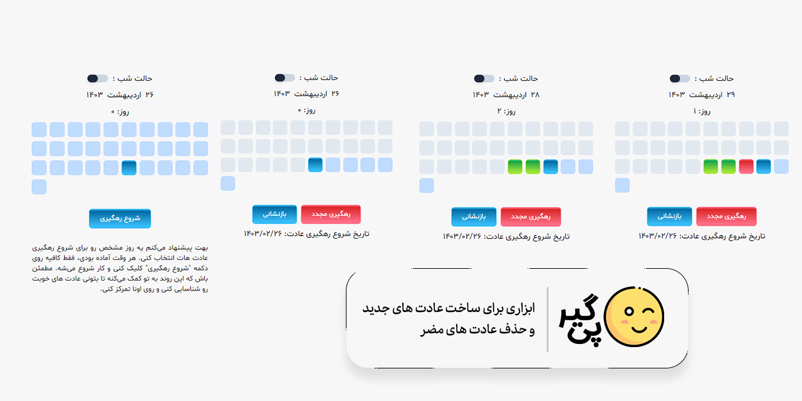

# 😉 پی‌گیر

بریم شروع کنیم با رهگیری عاداتت! واقعا هم وقتشه که یکم به این موضوع برسی. عادت های روزانه مون خیلی تاثیر می‌ذارن روی زندگیمون، ولی اکثرا اصلا متوجه نمی‌شیم این عادت ها چیکار دارن باهامون می‌کنن.

بهت پیشنهاد می‌کنم یه روز مشخص رو برای شروع رهگیری عادت هات انتخاب کنی. هر وقت آماده بودی، فقط کافیه روی دکمه
**"شروع رهگیری"**
  کلیک کنی و کار شروع می‌شه. مطمئن باش که این روند به تو کمک می‌کنه تا بتونی عادت های خوبت رو شناسایی کنی و روی اونا تمرکز کنی.

منتظر شنیدن نتیجه تلاش هات هستم! به موفقیت خودت ایمان داشته باش، مطمئن باش که می‌تونی این کار رو انجام بدی.

راستی میتونی این سایت رو مثل یک برنامه نصب کنی و بدون نیاز به اینترنت هم ازش استفاده کنی. خیلی راحت و دسترس‌پذیره!
مشتاقانه منتظر نظرات و پیشنهاداتتون هستم.

[لینک سایت]('https://myadegari.github.io/habit-tracker/')

### تکنولوژی های استفاده شده برای طراحی این ابزار

# 😉Track It
It's time to start tracking your habits! This is really an important thing to focus on. Our daily habits have a huge impact on our lives, but most of the time we don't even realize how these habits are affecting us.

I'd suggest picking a specific day to start tracking your habits. Whenever you're ready, just click the 
**"Start Tracking"**
 button and the process will begin. I'm sure this process will help you identify your good habits and allow you to focus on them.

I'm looking forward to hearing about your progress! Believe in your own success - I'm confident you can do this.

You can actually install this website like an app and use it without needing the internet. It's super convenient and accessible!

Feel free to share your thoughts and suggestions—I'm eagerly waiting! 😊

[Website Link !]('https://myadegari.github.io/habit-tracker/')

